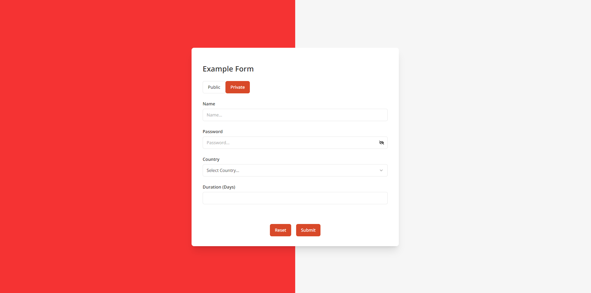

# Form Validation Task

## How to run the project

1.  Install dependencies with `yarn install`.
2.  Run `yarn dev` to start the application.

Access the application at `http://localhost:3000`.

## Introduction

📋 This repository contains the solution for a frontend recruitment task focused on building a form component in a Next.js application. The goal of the task was to implement various form functionalities using modern frontend development practices, with an emphasis on validation, accessibility, and user experience.

## Task Requirements

The form needed to include the following features:

- A public/private switch with "private" as the default value (implemented without external libraries).
- When set to private, an additional password field should be displayed.
- Validation rules for form fields:
  - All fields are required.
  - Name should be between 3 and 50 characters long.
  - Country select options should be limited to Poland, Germany, France, and Spain. In private mode, France and Spain should be excluded.
  - Duration must be a positive integer, and in private mode, it cannot exceed 20 days.
  - The password must be at least 8 characters long and include one uppercase letter, one lowercase letter, one number, and one special character.
- Display error messages for all fields when validation fails.
- A `Reset` button to clear all form fields.
- Server-side form submission that validates the data again and returns a JSON object with a success indicator.

## Solution

I implemented the form using **react-hook-form** for efficient form handling and validation. Some notable features of the implementation include:

- **Dynamic Password Field**: The password field is conditionally displayed when the form is set to private mode. I added a functionality that allows users to toggle the visibility of the password using icons (`FaEye` and `FaEyeSlash` from react-icons), improving the user experience.
- **Country Selection**: The country selection dropdown dynamically adjusts its available options based on whether the form is in public or private mode.
- **Validation and Error Handling**: All fields have built-in validation, and clear error messages are displayed when validation fails. React-hook-form helps manage state efficiently, reducing re-renders and ensuring smooth user interaction.
- **Accessibility**: I ensured that the form complies with accessibility standards by adding proper ARIA attributes and implementing keyboard-navigable components.
- **Server-Side Validation**: The form submission is handled server-side, where the data is validated again before returning a success or error message.

### Additional Features

- **Improved UX**: I made slight design adjustments to improve the user experience by refining the layout and enhancing form feedback, making the form easier to interact with for the end user.
- **Password Visibility Toggle**: Users can toggle between hiding and showing the password using an eye icon, enhancing usability.
- **Fully Responsive**: The form is responsive and works well on all screen sizes, ensuring a good user experience on both mobile and desktop.

### Technologies Used

- **Next.js**: For building the application.
- **React-Hook-Form**: For efficient form state management and validation.
- **jest-axe**: For testing accessibility compliance.
- **React-Icons**: For adding the password visibility toggle icons.
- **Tailwind CSS**: For styling the components.

## Conclusion

This project demonstrates a strong understanding of modern frontend practices, including form validation, accessibility, and user experience. It incorporates best practices for state management and ensures that the form is accessible and user-friendly.
